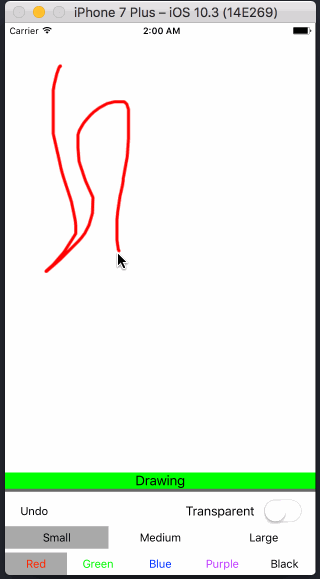

# DrawableView
> A UIView subclass that allows the user to draw on it.

[![Swift Version][swift-image]][swift-url]
[![License][license-image]][license-url]
[](https://github.com/Carthage/Carthage)
[](https://img.shields.io/cocoapods/v/DrawableView.svg)  
[](http://cocoapods.org/pods/DrawableView)
[](http://makeapullrequest.com)

Add a DrawableView to your app and you will immediately be able to draw on it. Then try changing the stroke color, width, and transparency!



## Features

- [x] Stroke Color
- [x] Stroke Width
- [x] Stroke Transparency
- [x] Undo
- [x] DrawableViewDelegate
- [x] Quad Curve Interpolation

## Requirements

- iOS 9.0+
- Xcode 8.3.1

## Installation

#### CocoaPods
You can use [CocoaPods](http://cocoapods.org/) to install `DrawableView` by adding it to your `Podfile`:

```ruby
pod 'DrawableView'
```

Simply import `DrawableView` wherever you would like to use it.

``` swift
import UIKit
import DrawableView
```
#### Carthage
Create a `Cartfile` that lists the framework and run `carthage update`. Follow the [instructions](https://github.com/Carthage/Carthage#if-youre-building-for-ios) to add `$(SRCROOT)/Carthage/Build/iOS/DrawableView.framework` to an iOS project.

```
github "EthanSchatzline/DrawableView"
```

## Usage example

```swift
class ViewController: UIViewController, DrawableViewDelegate {

    @IBOutlet var drawableView: DrawableView! {
      didSet {
        drawableView.delegate = self
        drawableView.strokeColor = .blue
        drawableView.strokeWidth = 12.0
        drawableView.transparency = 1.0
      }
    }

    func setDrawing(_ isDrawing: Bool) {
        /*
        Run some logic based on if the user is currently drawing a stroke or not.
        Commonly people hide the drawing tools UI while the user is drawing and fade it back in once they stop.
        */
    }

    func saveDrawingToPhotoLibrary() {
      guard let drawnImage = drawableView.image else { return }
      UIImageWriteToSavedPhotosAlbum(drawnImage, self, nil, nil)
    }
}
```

## Contribute

We would love for you to contribute to **DrawableView**, check the ``LICENSE`` file for more info.

## Meta

Ethan Schatzline – [@_Easy_E](https://twitter.com/_easy_e) – Ethan@EthanSchatzline.me

Distributed under the MIT license. See ``LICENSE`` for more information.

[https://github.com/EthansShatzline/](https://github.com/EthanSchatzline/)

[swift-image]:https://img.shields.io/badge/swift-4-orange.svg
[swift-url]: https://swift.org/
[license-image]: https://img.shields.io/badge/License-MIT-blue.svg
[license-url]: LICENSE
[travis-image]: https://img.shields.io/travis/dbader/node-datadog-metrics/master.svg?style=flat-square
[travis-url]: https://travis-ci.org/dbader/node-datadog-metrics
[codebeat-image]: https://codebeat.co/badges/c19b47ea-2f9d-45df-8458-b2d952fe9dad
[codebeat-url]: https://codebeat.co/projects/github-com-vsouza-awesomeios-com
